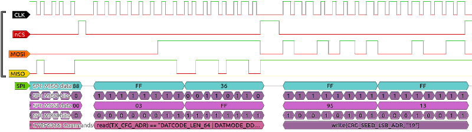

# cyrf6936 decoder for sigrok / libsigrokdecoder

The cyrf6936 protocol decoder decodes the Cypress LP/LPstar CYRF6936 2.4GHz transceiver chip protocol into human-readable pseudo-code.
It stacks on top of the SPI PD.



## Hardware

The chip is often used as a radio module for RC transmitters/receivers, including DSM, DEVO, and CARSON brands.

## Protocol

Communication with the chip is via a 4-pin SPI (MOSI, MISO, CLK, CSn) or 3-pin SPI (SDAT, CLK, CSn) protocol with an optional IRQ line.
First byte sent by the master includes direction (read/write), address and a bit to denote a multi-byte read with auto-incrementing addresses.
The following bytes are data bytes.

The chip has single byte registers (for e.g. config bits) and multi byte registers (for e.g. data payload).

## Usage

```
$ sigrok-cli --protocol-decoders cyrf6936 --show

ID: cyrf6936
Name: CYRF6936
Long name: Cypress CYRF6936 WirelessUSB(TM) LP 2.4 GHz Radio SoC
Description: 2.4GHz transceiver chip.
License: gplv3+
Annotation classes:
- write: Write
- read: Read
- tx-data: Payload sent to the device
- rx-data: Payload read from the device
- state: State change
- warning: Warnings
- wait: Wait
Annotation rows:
- cmd (Commands): write, read, tx-data, rx-data
- warnings (Warnings): warning, state
- delays (Delays): wait
Binary classes:
None.
Required channels:
None.
Optional channels:
None.
Options:
- spi3pin: SPI 3-Pin mode with MOSI/MISO combined as SDAT on the MOSI pin ('no', 'yes', default 'no')
- delaysplit: annotate delays (in us) larger than... (0 = off) (default 0)
Documentation:
This decoder stacks on top of the 'spi' PD and decodes the protocol spoken
by the Cypress CYRF6936 2.4GHz transceiver chips.

Details:
http://www.cypress.com/file/136666/download#page=105
http://www.cypress.com/file/126466/download#page=15
```

### Example
```
$ sigrok-cli -i sample.srzip -P spi:wordsize=8:clk=CLK:cs=nCS:mosi=MOSI:miso=MISO,cyrf6936:delaysplit=2000 -A cyrf6936=write:read:wait | sed -e 's/delay\(.*\)/\ndelay\1\n/' 

write(IO_CFG_ADR, "IRQ_POL | PACTL_GPIO")
write(RX_CFG_ADR, "AUTO_AGC_EN | LO | FASTTURN_EN")
write(TX_OFFSET_LSB_ADR, "85")
write(TX_OFFSET_MSB_ADR, "5")
write(XACT_CFG_ADR, "ACK_EN | END_STATE_SLEEP | ACK_TO_12X")
write(TX_CFG_ADR, "DATCODE_LEN_64 | DATMODE_DDR | PA_0_DBM")
write(FRAMING_CFG_ADR, "SOP_EN | LEN_EN | SOP_THRESH_0x04")
write(PREAMBLE_ADR, "0x333302")
write(XTAL_CTRL_ADR, "XOUT_FNC_GPIO | XOUT_FREQ_P75MHZ")
read(IO_CFG_ADR) == "IRQ_POL | PACTL_GPIO"
read(RX_CFG_ADR) == "AUTO_AGC_EN | LO | FASTTURN_EN"
read(TX_CFG_ADR) == "DATCODE_LEN_64 | DATMODE_DDR | PA_0_DBM"
write(CRC_SEED_LSB_ADR, "19")
write(CRC_SEED_MSB_ADR, "236")
write(SOP_CODE_ADR, "0x0FA239AD0FA1C59B")
write(TX_CFG_ADR, "DATCODE_LEN_64 | DATMODE_DDR | PA_4_DBM")
write(CHANNEL_ADR, "CHANNEL 61 (2.461GHz, 270us_slow)")
write(GPIO_CTRL_ADR, "MISO_OP | PACTL_OP | IRQ_OP | XOUT_IP | MISO_IP | PACTL_IP | IRQ_IP")
write(TX_CTRL_ADR, "TX_CLR")
write(TX_LENGTH_ADR, "12")
write(TX_BUFFER_ADR, "0x11AF000081968B8F8F8F3E0F")
write(TX_CTRL_ADR, "TX_GO | TXC_IRQEN")
read(TX_IRQ_STATUS_ADR) == "TXB15_IRQ

```


## Resources
* [Manufacturer Website](http://www.cypress.com/part/cyrf6936-40ltxc)
* [Datasheet](http://www.cypress.com/file/126466/download)
* [Technical Reference Manual](http://www.cypress.com/file/136666/download)
